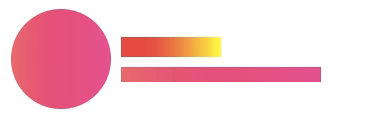
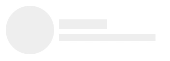
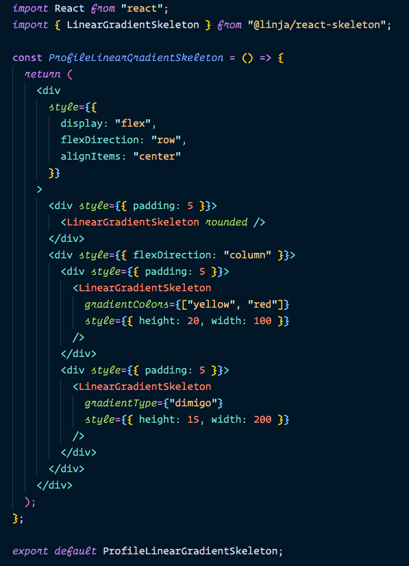
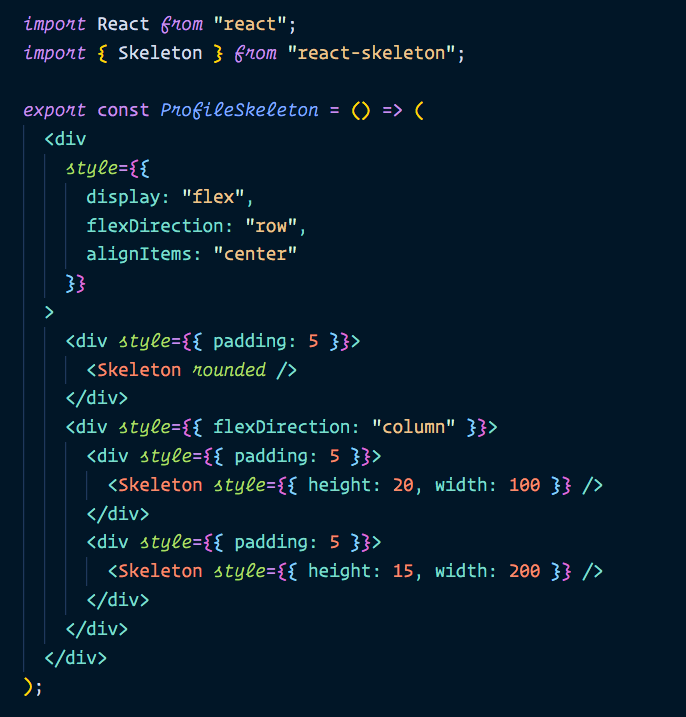

# react-skeleton

We all know that without loader in _React_ components, user interface will not complete. We usually show a spinner or a text informing that data is loading... better way to show a user that what our _ui_ look like in a _Skeleton_ of components. _*react-skeleton*_ is usefull to show a loading in react components.

### Examples

#### Using LinearGradientSkeleton



<a href="#linear-gradient-example"> see code </a>

#### Using Skeleton



<a href="#normal-skeleton-example"> see code </a>

### Installing

```

npm install react-skeleton --save

OR

yarn add react-skeleton --save

```

### Usage

### 🔹 Normal Skeleton

```js
import React from "react";
import { Skeleton } from "react-skeleton";

export const GoodLoader = () => {
  return <Skeleton />;
};
```

<details>
  <summary> Normal Skeleton Props </summary>
  <table>
    <th> prop name </th>
    <th> type </th>
    <th> values </th>
    <th> default value </th>
    <th> description </th>
     <tr>
      <td> rounded </td>
      <td> boolean </td>
      <td> true/false </td>
      <td> false </td>
      <td> show a circle instead of rectangle </td>    
    </tr>
    <tr>
      <td> style </td>
      <td> html style attributes </td>
      <td> html style attributes </td>
      <td> {} </td>
      <td> addition style for elements </td>
    </tr>
  </table>
</details>

### 🔹 Linear Gradient Skeleton

```js
import React from "react";
import { LinearGradientSkeleton } from "react-skeleton";

export const GoodLoader = () => {
  return <LinearGradientSkeleton />;
};
```

<details>
  <summary> Linear Gradient Props </summary>
  <table>
    <th> prop name </th>
    <th> type </th>
    <th> values </th>
    <th> default value </th>
    <th> description </th>
    <tr>
      <td> gradientType </td>
      <td> string </td>
      <td> "dimigo", "skyline", "mango", "bluelagoo" </td>
      <td> "dimigo" </td>
      <td> themes of linear gradient </td>
    </tr>
    <tr>
      <td> gradientColors </td>
      <td> string[] </td>
      <td> any color combination ex: ["#ec008c", "#fc6767"] </td>
      <td> </td>
      <td> colors for linear gradient </td>
    </tr>
    <tr>
      <td> rounded </td>
      <td> boolean </td>
      <td> true/false </td>
      <td> false </td>
      <td> show a circle instead of rectangle </td>    
    </tr>
    <tr>
      <td> style </td>
      <td> html style attributes </td>
      <td> html style attributes </td>
      <td> {} </td>
      <td> addition style for elements </td>
    </tr>

  </table>

</details>

### Examples code

<h3 id="linear-gradient-example"> Linear Gradient Skeleton Example </h2>



<h3 id="normal-skeleton-example"> Normal Skeleton Example </h2>



## Contributing

Pull requests are welcome. For major changes, please open an issue first to discuss what you would like to change.

Please make sure to update tests as appropriate.

## License

This project is licensed under the MIT License - see the [LICENSE](LICENSE) file for details
